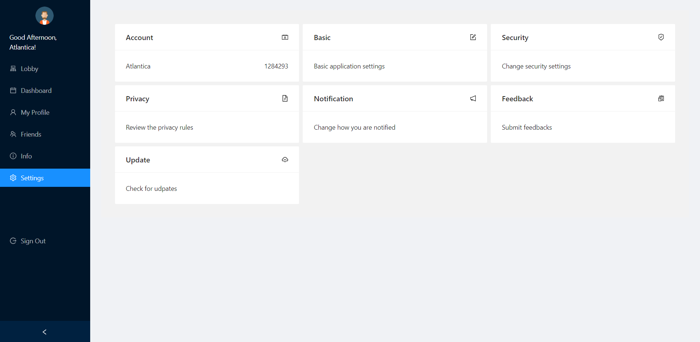

# The Study Group Guide
The Study Group is an online study platform that provides public study room for university students to study together.
With the help of our app, in this difficult times of COVID-19, our target audience is granted capacity to socialize, making new friends and maintaining relationship with existing friends.
## Features
Lobby

Study Room

Dashboard

My Profile

Friends

Info

Settings

Sign up, Log in and Sign out

## Lobby
Display the list of available study rooms. 

#### Usage:
* Create Room
* Search Room
* Filter Room
* Quick Match

#### Tip:
This is one of the most powerful and useful command of The Study Group, it is the public entry point.

## Study Room
Video conference portals that allows you to virtually present in the online study room.

#### Functionality:
* Turn on/off video
* Turn on/off audio
* Chat
* Screenshare

## Dashboard
Displays statistics of your usage of The Study Group.

#### Coverage:
Including information regarding 
* The time you spent studying this month compared to last month
* The number of stars you received
* Target for the day
* Study hours on each day over the week
* Yearly summary

## My Profile
Displays your account information.

##### Purpose:
Serves as the control panel of your account to:
* Display account ID
* Check and update email
* Check experience and level
* Edit motto
* Check number of coins owned
* Edit basic information
* Path to view your friends
* Path to view your tasks
* Edit your password

## Friends
Shows you the list of your friends and ranks them based on their performance in the past week.

## Info
A minimalistic information stack and tip center for users
(Could implement a FAQ section in the next phase)

##### Tip
View the slides, hover cursor over the carousel to pause the autoplay to read.

## Settings
Edit settings of this app

##### Functionality
* Account
* Basic Settings
* Security
* Privacy
* Notification Manager
* Feedback to our team
* Update
